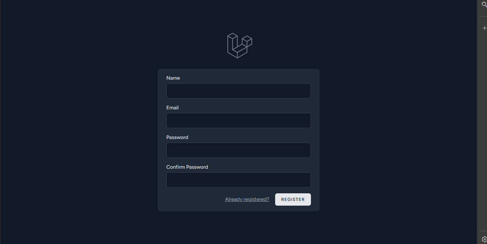
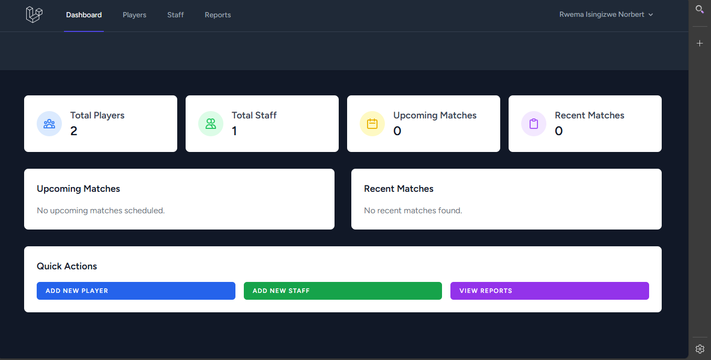
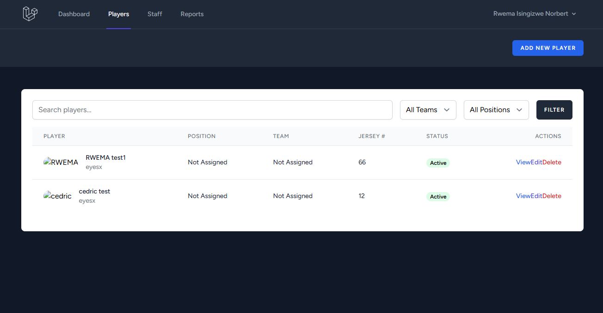
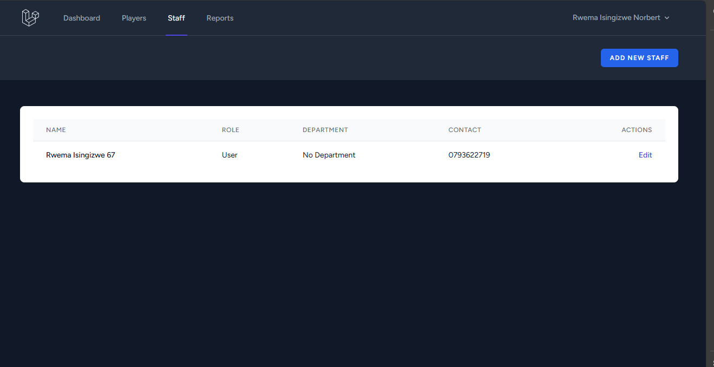

# Kaine FC Team Management System

Kaine FC is a Laravel web application designed to manage every aspect of the Kaine FC football team. It provides tools for handling player and staff information, match scheduling and results, attendance tracking, team administration, and detailed reporting.

## Features

- **Player Management:** Create, update, and view player profiles, contracts, medical info, positions, and team assignments.
- **Staff Management:** Manage staff roles, departments, contact info, qualifications, and employment status.
- **Team Administration:** Organize teams, assign coaches, manage categories, and track team status.
- **Match Scheduling & Results:** Schedule matches, record results, and view summaries and highlights.
- **Attendance Tracking:** Record attendance for players and staff, including check-in/out times and status.
- **Position & Category Management:** Define and manage player positions and categories for better organization.
- **Department Management:** Create and manage team departments for staff and players.
- **Reporting:** Generate reports on player performance, staff attendance, match results, and financials.
- **User Profiles & Authentication:** Secure login, profile management, password updates, and account deletion.
- **Dashboard:** View statistics on players, staff, upcoming and recent matches.

## Getting Started

### Prerequisites

- PHP >= 8.0
- Composer
- Node.js & npm
- MySQL or compatible database

### Installation

1. Clone the repository:
   ```powershell
   git clone https://github.com/RWEMAISINGIZWENorbert/kaineFc.git
   ```
2. Install PHP dependencies:
   ```powershell
   composer install
   ```
3. Install frontend dependencies:
   ```powershell
   npm install
   ```
4. Copy `.env.example` to `.env` and configure your environment variables.
5. Generate application key:
   ```powershell
   php artisan key:generate
   ```
6. Run migrations and seeders:
   ```powershell
   php artisan migrate --seed
   ```
7. Start the development server:
   ```powershell
   php artisan serve
   ```

## Usage

- Access the app at `http://localhost:8000`.
- Log in to manage team data, view reports, and update profiles.

## Screenshots

### Authentication


### Dashboard


### Players Management


### Staff Management


### Add Player/Staff Form


## Contributing

Contributions are welcome! Please submit issues or pull requests for improvements.

## License

This project is open-sourced under the [MIT license](https://opensource.org/licenses/MIT).
